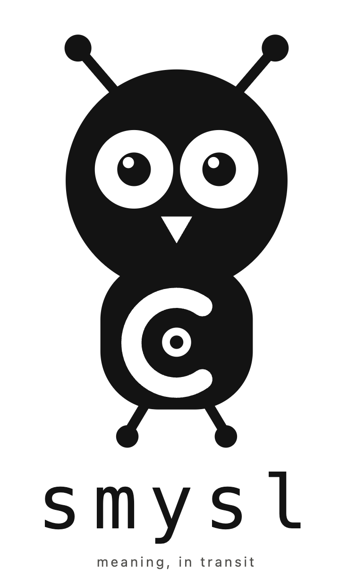

# smysl

**One format that both AI systems and people can read, write, and trust.**

[](https://github.com/vulogov/smysl/actions/workflows/ci.yml)


[](LICENSE)

---

## The problem

When one AI hands work to another, it usually hands over **prose**.

Prose is a bad container. The model that wrote it *had* a structure in mind — this is
solid, that is a guess, this rests on that, these two sources disagree — and then it
flattened all of it into paragraphs. The next model has to guess that structure back from
the text. Then it summarises again for the model after it.

Every hop loses something, and it is always the same things:

- **Hedges vanish.** "The data suggests" becomes "the data shows" becomes "we found".
- **Sources evaporate.** By hop three, nobody can say where the number came from.
- **Disagreement disappears.** Two conflicting findings go in; whichever one the last
  summariser preferred comes out. The conflict is not resolved, just dropped.

The usual fix is a custom JSON schema between each pair of systems. That works for the
machines and locks the humans out: nobody reviews a wire format, so the one place a person
could have caught the drift is the place they cannot see.

## The idea

`smysl` is a single format that is **precise enough for machines and readable enough for
people** — so the same artifact travels the whole chain without ever being translated.

```
   model ──▶ model ──▶ human reviews & edits ──▶ model ──▶ report
     └──────────── the same smysl document throughout ───────────┘
```

No adapter at any hop. The AI writes it, another AI merges it, a person opens it in a text
editor and fixes a line, and the next AI picks it up from there.

## What it looks like

This is a real, complete document. It is also the wire format — there is no separate
"machine version".

```
@doc smysl/0.1 { id: v/f1, intent: incident-brief, roots: [f/root-cause] }

@evidence e/pool-wait { status: measured, source: { kind: metric, ref: "pool.wait_ms{shard=eu-west}", captured: 2026-07-09 } }
~ Pool acquisition wait rose from 2 ms to 310 ms over the same window.

@evidence e/canary { status: measured, source: { kind: metric, ref: "canary.p95", captured: 2026-07-09 } }
~ The 4.2 canary ran the same pool configuration without the regression.

@claim c/pool-saturation { status: inferred, grounds: [e/pool-wait] }
~ The eu-west connection pool is saturated.

@claim c/canary-clean { status: derived, grounds: [e/canary] }
~ The canary rules out a pure configuration cause.

@finding f/root-cause { status: inferred, grounds: [c/pool-saturation, c/canary-clean] }
~ Pool saturation is the leading cause but is not consistent with the canary.

@rel c/canary-clean --rebuts--> c/pool-saturation { weight: 0.6 }
```

You can read that. So can a machine, exactly. Three things are being carried that prose
would have dropped:

- **How sure it is.** `measured` (an instrument recorded it) is a different thing from
  `inferred` (a model reasoned it out). The scale runs `unfounded` → `speculative` →
  `inferred` → `derived` → `cited` → `measured`.
- **What it rests on.** `grounds: [e/pool-wait]` means this claim stands or falls with that
  evidence. Retract the evidence and the tool tells you what else falls.
- **What contradicts it.** The `rebuts` edge is part of the document. The disagreement is
  recorded, not smoothed over.

## Why one shared format is worth it

**Nothing degrades in transit.** A guess cannot quietly become a fact. The rule is
mechanical: a conclusion may never be more certain than the weakest thing it rests on, and
it is checked, not hoped for. Confidence can only go down across hops, never up.

**Summarising costs nothing.** Fitting a document to a token budget is ordinary
computation over the graph, not another model call:

```bash
$ smysl --format surface pack --budget 8k --focus c/pool-saturation incident.smy
```

Same input, same budget, same bytes out — every time, on any machine, for free. If a claim
is included, its rebuttals come with it; a budget too small to hold both **fails** rather
than shipping the claim without the objection to it.

Measured over the eight-fixture corpus at 60% of full detail, across five handoffs: tokens
fall to **0.24–0.60** of the whole while **every unit survives on five of six** fixtures.
The saving is bodies dropping to gist, not claims being discarded. `cargo test -p
smysl-eval` reproduces it, without calling a model.

**And measured against the alternative.** The same fixture through five prose handoffs, a
real model summarising at each one, judged by a model that is shown a claim and a passage
and asked what the *passage* supports:

| Five hops, 5 fixtures × 2 models | Tokens | Claims kept | Hedges lost | Sources kept |
|---|---|---|---|---|
| control — no summarisation | 1.00 | 90 / 90 | **0 / 90** | **50 / 50** |
| prose baseline | 0.29 | 73 / 90 | **42 / 90** | **1 / 50** |
| smysl | 0.49 | 90 / 90 | **0 / 90** | **50 / 50** |

Ten runs: F1–F5 through `gemini-3.5-flash-lite` and `deepseek-chat`, 90 claims in total. The
two models agree closely, which is the point of running two — one model's habits are
indistinguishable from a property of the format when there is nothing to compare them
against.

**The prose chain compresses harder** — 0.29 against 0.49 — and pays for it twice. Forty-two
of ninety surviving claims came out reading as *measurements* when the original called them
inferred, cited or derived. And of the fifty claims that named where they came from, **one
survived**. A guess arriving as a finding, and a number nobody can trace, are the two
failures this format exists to prevent; both are visible here at scale rather than as
anecdote.

On the smysl side neither is luck. Confidence is a field that rule M checks; the source is a
field that travels with anything that travels. Nothing is preserved by good behaviour.

Read it with its limits: two models, five fixtures, one run each — enough to say the effect
is not one model's quirk, not enough to put an error bar on it. The control row is what makes
it worth anything at all. The baseline prose states every hedge *and every source* in words,
and the same judge recovers all of them before any summarisation — it abstained on none of
the ninety — so the losses after five hops are the chain's, not the instrument's. The live
test refuses to report any row whose control does not clear. `make eval-live` reproduces it.

**People stay in the loop without a special tool.** The review artifact *is* the document.
No dashboard to build, no viewer to install — open it, read it, change a line, save it.
A human correction is a first-class edit, not a bug report filed against a pipeline.

**Many agents can work at once.** Merging two documents is a set union with no coordinator
and no locking, and it does not matter what order they arrive in. Where two agents disagree,
merge **records the contention** instead of picking a winner.

```bash
$ smysl merge agent-a.smy agent-b.smy -o combined.cbor
agent-b.smy: contention k/ccm3actwjjti65famnoe6mapo5d over b3:cvhirtgs2mpvli2ethhyeo32uf (2 positions, live-rebuttal)
```

This works because a unit's real identity is a hash of its content, not its position in a
file. Two agents that independently record the same fact produce the same identifier and
merge into one unit, with no registry and nobody assigning ids. Names like
`c/pool-saturation` are local nicknames for reading and writing; `b3:…` is the identity
that survives merging.

**Every answer can be traced.** Ask where a conclusion came from and get the actual chain,
because the chain was carried rather than reconstructed.

```bash
$ smysl trace b3:cvhirtgs2mpvli2ethhyeo32uf --grounds incident.smy
b3:cvhirtgs2mpvli2ethhyeo32uf (root)
  b3:izyuzlt42mqcvgdfb4nfpllxyq (grounds)
incident.smy: 2 unit(s) over 1 step(s)
```

## Getting content in

Existing prose gets converted by a model — the one place a model is required:

```bash
$ smysl ingest report.md
7 unit(s) staged in ./.smysl/staged.smy; review, then `smysl merge --staged`
```

Three safeguards apply at that boundary, because a model's output is a proposal rather
than a fact:

- **It cannot overstate itself.** A model reading a document may claim at most "cited". If
  it says `measured`, it is downgraded and told so.
- **It cannot fail silently.** A passage the model mangles is kept verbatim as opaque text
  and flagged, so a partial result is still usable.
- **It cannot write straight into your data.** Output lands in a staging file for you to
  read first. `merge --staged` is your confirmation.

Model access is off unless you configure it. `--offline` refuses to open a socket at all,
and `providers --tasks` tells you in advance which commands would leave the machine. API
keys are never stored in config — only the name of an environment variable or a command
that returns one.

## Everything else is deterministic

Only `ingest` and `attest` consult a model. Selecting, merging, ordering, ranking and
rendering are pure functions — same input, same output, byte for byte, verified in CI:

| Command | What it does |
|---|---|
| `check` | Validate a document and explain what is wrong |
| `merge` | Combine documents; record disagreements |
| `pack` | Fit to a token budget without calling a model |
| `thread` | Order a graph into a readable narrative |
| `render` | Emit Markdown, HTML, Typst and more |
| `trace` / `diff` | Follow provenance; compare two versions |
| `salience` | Rank what matters, with the arithmetic shown |
| `retract` | Remove a claim and report the blast radius first |
| `ui` | Browse a store; watch the budget bind, live |

`smysl ui` is worth a minute if the packing rules seem abstract. Pin a claim with `f`,
hold `-`, and watch which units survive and why — until the budget drops below the floor
and packing refuses outright rather than shipping a claim without the rebuttal that
answers it:

```
INFEASIBLE
The mandatory floor needs 46 tokens; the budget is 0.
```

## Quick start

```bash
$ cargo build
$ ./target/debug/smysl check fixtures/corpus/F1-incident.smy
fixtures/corpus/F1-incident.smy: 13 records, 8 units, 0 diagnostic(s)

$ ./target/debug/smysl --format surface pack --budget 200 --explain fixtures/corpus/F1-incident.smy
b3:cvhirtgs2mpvli2ethhyeo32uf @L0  -  earned on density
b3:phsoomklkmlq3sjvbe6cyuqy5v @L0  C3  rebuts b3:cvhirtgs2mpvli2ethhyeo32uf
b3:xkys7j42mcuyiaxiyh73xddimr dropped: low-value
fixtures/corpus/F1-incident.smy: 7 of 8 unit(s), 193 of 200 tokens, greedy mode, gap 0.011
```

Read the middle line: that unit was kept **because** it rebuts one that was kept. The
selection cannot quietly drop an objection to something it is showing you.

Two flags worth knowing. `--format surface` prints readable text; output defaults to CBOR,
which is what you want in a pipeline and not in a terminal. `--explain` goes to stderr, so
the reasoning never contaminates the data on stdout — above, the packed document itself is
on stdout and elided here.

Ingest needs a model. [Ollama](https://ollama.com) runs locally, costs nothing, and never
leaves the machine:

```bash
$ ollama serve && ollama pull llama3.2
$ smysl providers --probe
$ smysl ingest notes.md
```

## Using it as a library

The library is the product; the CLI is its first consumer. Nothing the CLI does is
unreachable from the library.

```toml
[dependencies]
smysl = { version = "0.1", default-features = false }
```

With default features off you get a fully synchronous library — no async runtime, no HTTP
client, no argument parser anywhere in the dependency tree. That is verified in CI rather
than merely intended. Determinism is part of the API: making `pack`, `merge`,
`derive_thread`, `salience` or `render` non-reproducible is a breaking change whatever the
signature says.

## Status

Implements **RFC SMYSL-1 (Combined)** — format `smysl/0.1`, kernel `smysl.kernel/0.1`.
Version 0.1: usable and extensively tested, but the format may still shift before 1.0.

| Phase | Delivers | State |
|---|---|---|
| SM-P0 – P2 | scaffold, deterministic CBOR codec, surface syntax, `fmt` | **done** |
| SM-P3 – P4 | store, index, adjacency, check passes, `check` | **done** |
| SM-P5 – P6 | trust rules, merge, contentions, retraction | **done** |
| SM-P7 – P8 | lineage (`diff`, `trace`, `view`, `bundle`), salience | **done** |
| SM-P9 – P10 | budget packing, provably optimal mode | **done** |
| SM-P11 – P12 | thread derivation, render IR, six backends | **done** |
| SM-P13 – P14 | provider layer, ingest boundary, `attest` | **done** |
| SM-P15 | corpus F1–F8, evaluation harness (both arms), TUI, `ui` | **done** |

Model providers, and how far each has actually been proven — an untested mapper is a
reading of a vendor's documentation, not a fact about their API:

| Provider | State |
|---|---|
| Ollama (local) | verified against a running server |
| DeepSeek | verified against the live endpoint |
| Gemini | verified against the live endpoint |
| Anthropic | implemented, but not tested |
| OpenAI | implemented, but not tested |

That distinction has already earned its keep. Gemini's support was written from the
documentation, which describes its response schema as a subset of JSON Schema draft
2020-12. It is not one, so every structured call was refused until a live key proved it —
and no recorded test fixture could have caught that.

## Layout

```
src/                   facade crate: [lib] + [[bin]] smysl
crates/smysl-core      kernel types, deterministic codec, surface syntax, diagnostics
crates/smysl-graph     append-only store, index, adjacency, merge, salience
crates/smysl-check     the ten check passes
crates/smysl-pack      budget-bounded, closure-complete selection
crates/smysl-thread    thread schemas and deterministic derivation
crates/smysl-render    render IR, profiles, backends
crates/smysl-provider  the model boundary - the only crate linking a runtime
crates/smysl-ingest    staging, repair, trust ceiling, recipes
crates/smysl-tui       seven-pane terminal UI, with a live pack simulator
crates/smysl-eval      evaluation harness E1-E9 (not published)
fixtures/              corpus, conformance suite, golden artifacts
xtask/                 purity and determinism gates
```

## Building and testing

```bash
cargo build                       # cli + tui + local (Ollama) + Typst rendering
cargo build --no-default-features # pure library: no runtime, no HTTP, no arg parser
cargo test --workspace --all-features
```

Two gates run in CI and are worth running locally, because both check properties that
lapse silently rather than loudly:

```bash
cargo xtask check-purity   # the library stays synchronous and offline
cargo xtask determinism    # pure operations are bit-reproducible
```

No panics on untrusted input is checked two ways: a deterministic mutation sweep in
ordinary CI, and `cargo fuzz` targets under `fuzz/` for the surface parser and the CBOR
reader.

```bash
cargo +nightly fuzz run surface
```

## Licence

MPL-2.0.
